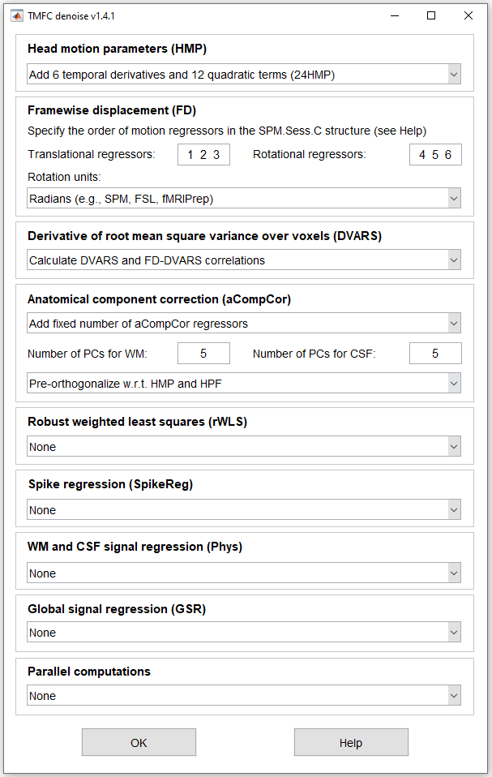
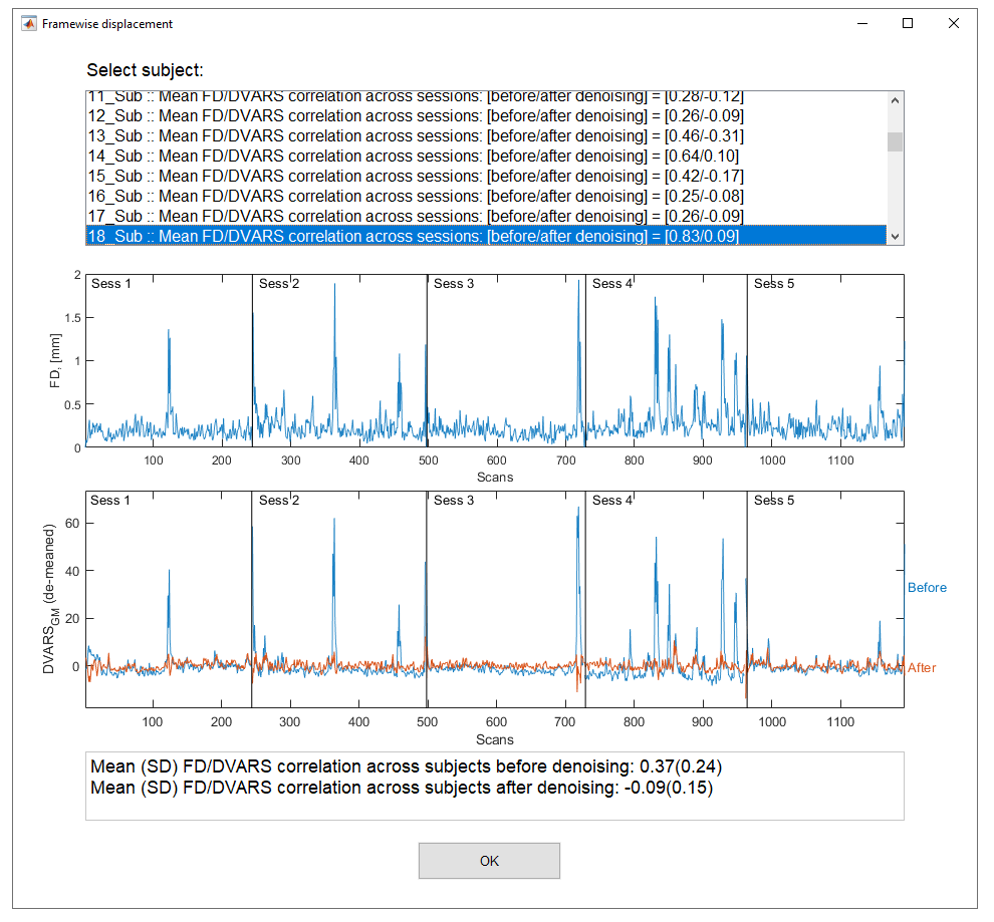

# TMFC_denoise

**TMFC_denoise** is a MATLAB toolbox for SPM12/SPM25 for GLM-based denoising (**noise regression**).

This toolbox allows you to **add noise regressors** to the original general linear model (GLM), calculate **framewise displacement (FD)**, Derivative of root mean square VARiance over voxelS **(DVARS)**, and **FD-DVARS correlation** before and after denoising. 

The updated GLMs can be used for **task activation analysis** or for **task-modulated functional connectivity (TMFC) analysis**.

For detailed documentation, please see: https://tmfc-denoise.readthedocs.io

## Installation
TMFC_denoise is available as a separate toolbox and as part of the **TMFC toolbox** (https://github.com/IHB-IBR-department/TMFC_toolbox).

1) Add SPM12/SPM25 to your MATLAB path.
2) Add **TMFC_denoise** <ins>OR</ins> **TMFC_toolbox** to your MATLAB path (Home --> Set Path --> Add with Subfolders --> Select TMFC_denoise <ins>OR</ins> TMFC_toolbox folder).
3) Enter **TMFC_denoise** in the command window to open the TMFC_denoise GUI  
   or  
   Enter **TMFC** in the command window to open the TMFC toolbox GUI, then press **Tools --> Denoise** button.

TMFC_denoise can be run via GUI or the command line. To run TMFC_denoise via the command line, see [*TMFC_denoise.m*](TMFC_denoise.m) function.

## Options

## Results

## Functionality of the TMFC_denoise toolbox:

- (1) Calculates head motion parameters (temporal derivatives and quadratic
     terms) (**6HMP, 12HMP, 24HMP**). Temporal derivatives are calculated as backward differences
     (Van Dijk et al., 2012). Quadratic terms represent 6 squared motion
     parameters and 6 squared temporal derivatives (Satterthwaite et al., 2013).

- (2) Calculates **framewise displacement (FD)** as the sum of the absolute values
     of the derivatives of translational and rotational motion parameters
     (Power et al., 2012).

- (3) Creates spike regressors based on a user-defined FD threshold (**Spike Regression**). For each
     flagged time point, a unit impulse function is included in the general linear
     model; it has the value 1 at that time point and 0 elsewhere
     (Lemieux et al., 2007; Satterthwaite et al., 2013).
  
- (4) Creates **eroded WM and CSF masks**.

- (5) Creates **aCompCor** regressors (Behzadi et al., 2007). Calculates a fixed
     number of principal components (PCs) or variable number of PCs
     explaining 50% of the signal variability separately for the eroded WM
     and CSF masks (Muschelli et al., 2014).   
 
- (6) Creates **WM/CSF regressors** (Fox et al., 2005). Calculates average
     BOLD signals separately for eroded WM and CSF masks. Optionally
     calculates derivatives and quadratic terms (Parkes et al., 2017) (**2PHYS, 4PHYS, 8PHYS**).

- (7) Creates global signal regressor (Fox et al., 2005, 2009). Calculates the average
     BOLD signal for the whole-brain mask. Optionally calculates
     derivatives and quadratic terms (Parkes et al., 2017) (**GSR, 2GSR, 4GSR**).

- (8) Calculates the temporal Derivative of root mean square VARiance over voxelS (**DVARS**).
     DVARS is computed as the root mean square (RMS) of the differentiated
     BOLD time series within the GM mask (Muschelli et al., 2014).
     Also computes **FD-DVARS correlations**. 
     DVARS is computed both before and after noise regression 
     (for the original and updated GLM, respectively).

- (9) Adds noise regressors to the original model and estimates it. The noise
     regressors and the updated model are stored in the TMFC_denoise subfolder.

- (10) Can use robust weighted least squares (**rWLS**) for model estimation (Diedrichsen & Shadmehr, 2005).
     It assumes that each image has its own variance parameter; some scans
     may be disrupted by noise (high variance). In the first pass, SPM 
     estimates the noise variances; in the second pass, each image
     is reweighted by the inverse of its variance.
