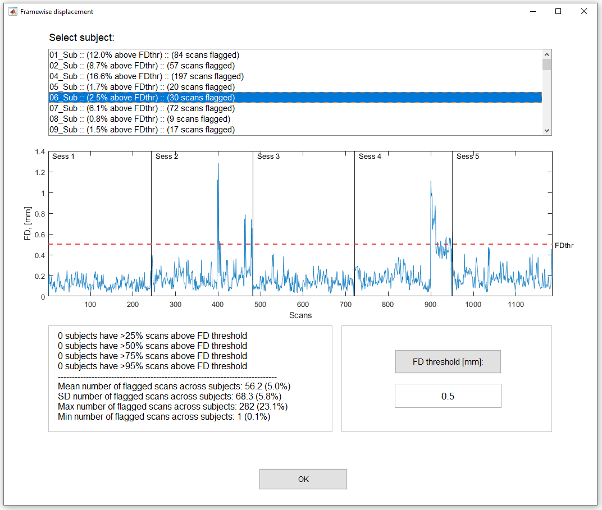

# TMFC_denoise
SPM-based toolbox for fMRI task denoising. 

Can be run via GUI or command line.

To run TMFC denoise via GUI enter: tmfc_denoise

----------------------------------------------
Options:

----------------------------------------------
FD plots:

----------------------------------------------
Results:

