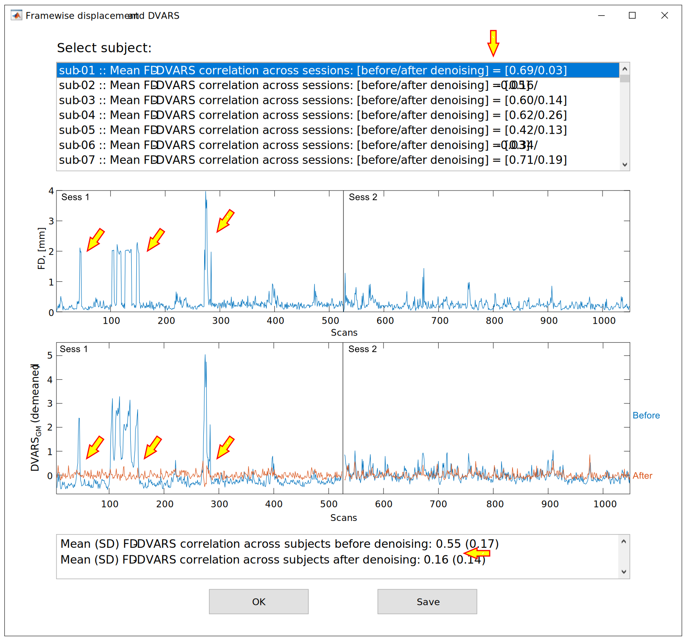

Quality Control: DVARS and FD-DVARS correlations
================================================

The ``tmfc_calculate_DVARS`` function calculates DVARS within the GM mask before and after noise regression. 
It is called automatically by the main function ``TMFC_denoise`` if the user has selected the corresponding option, or it can be run manually::

    [preDVARS,postDVARS] = tmfc_calculate_DVARS(FD,SPM_paths,options,masks,output_paths);

The outputs are saved in ``TMFC_denoise/[WM*e*]_[CSF*e*]_[GM*d*]`` subfolders:

 - ``DVARS_before_denoising.mat`` – contains DVARS time series for each session before noise regression, session-wise FD-DVARS and task-DVARS correlations, and mean/max FD-DVARS (and task-DVARS) correlation across sessions. 
 - ``DVARS_*.mat`` – contains the same information as the previous file, but after noise regression. Filenames encode the selected denoising options (e.g., ``DVARS_[24HMP]_[aCompCor50]_[rWLS].mat``).

----

The GUI window for DVARS time-series inspection is opened with ``tmfc_plot_DVARS``. It is called automatically by the main function ``TMFC_denoise``.

   Graphical interface for DVARS time-series inspection. Example DVARS plot for a single subject. The FD-DVARS correlation was reduced from 0.69 to 0.03 after noise regression. Spikes in the DVARS time series during the first session, associated with high-motion events, were visibly diminished. At the group level, the mean FD-DVARS correlation was decreased toward zero. 

To open DVARS plot GUI manually run:

.. code-block:: matlab

   % Allows saving group FD-DVARS statistics only:
   tmfc_plot_DVARS(preDVARS,postDVARS,FD);

   % Allows saving group FD-DVARS statistics and TMFC denoise settings:
   tmfc_plot_DVARS(preDVARS,postDVARS,FD,options,SPM_paths,subject_paths,anat_paths,func_paths,masks);

Pressing the :menuselection:`Save` button stores individual subject FD and DVARS data, as well as group-wise DVARS statistics, in a single ``*.mat`` file:

.. list-table:: Group_FD_DVARS.mat file
   :header-rows: 1
   :widths: 20 80

   * - **Field**
     - **Description**
   * - denoising_settings (struct)
     - Selected TMFC_denoise settings:

       - **SPM_paths:** see :ref:`select-sub`
       - **subject_paths:** see :ref:`select-sub`
       - **options:** see :ref:`options`
       - **anat_paths:** see :ref:`select-anat`
       - **func_paths:** see :ref:`select-func`
       - **masks:** see :ref:`masks`

   * - FD (struct)
     - Individual FD data for all subjects (see :ref:`FD`).
   * - group_mean_post_FD_DVARS_corr
     - Group mean FD-DVARS correlation after denoising.
   * - group_mean_pre_FD_DVARS_corr
     - Group mean FD-DVARS correlation before denoising.
   * - group_SD_post_FD_DVARS_corr
     - Group SD of FD-DVARS correlation after denoising.
   * - group_SD_pre_FD_DVARS_corr
     - Group SD of FD-DVARS correlation before denoising.
   * - postDVARS (struct)
     - DVARS data for each subject (after denoising).

       - **Sess:** Incluse DVARS time series, FD-DVARS and task-DVARS correlations for each session. 
       - **Mean_FD_DVARS_corr:** Mean FD-DVARS correlation across sessions. 
       - **Max_FD_DVARS_corr:** Maximum FD-DVARS correlation across sessions. 
       - **taskDVARS_corr_mean:** Mean task-DVARS correlation across sessions. 
       - **taskDVARS_corr_maxabs:** Maximum abs(task-DVARS correlation) across sessions. 
       - **taskDVARS_corr_maxabs_name:** Name of the corresponding task condition.

   * - preDVARS (struct)
     - DVARS data for each subject (before denoising).

       - **Sess:** Incluse DVARS time series, FD-DVARS and task-DVARS correlations for each session. 
       - **Mean_FD_DVARS_corr:** Mean FD-DVARS correlation across sessions. 
       - **Max_FD_DVARS_corr:** Maximum FD-DVARS correlation across sessions.
       - **taskDVARS_corr_mean:** Mean task-DVARS correlation across sessions. 
       - **taskDVARS_corr_maxabs:** Maximum abs(task-DVARS correlation) across sessions. 
       - **taskDVARS_corr_maxabs_name:** Name of the corresponding task condition.       

These values can be reported to demonstrate the effectiveness of noise regression. 
If denoising is successful, spikes in the DVARS time series at high-motion time points should be reduced, and the FD-DVARS correlation should approach zero.

