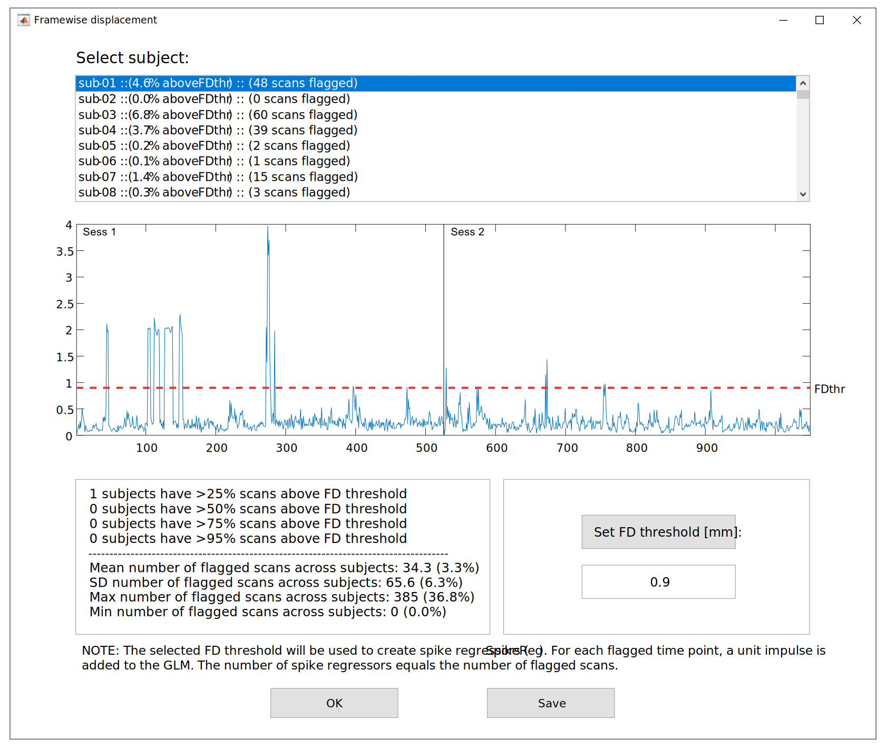

.. _FD:

HMP expansions and FD plots
===========================

The function ``tmfc_head_motion`` calculates HMP expansions and the FD time series. Also calculates task-FD correlations.
It is called automatically by the main function ``TMFC_denoise`` or can be run manually::

    FD = tmfc_head_motion(SPM_paths,subject_paths,options);

The outputs are saved in the ``TMFC_denoise`` subfolder within each subject’s first-level GLM directory: ``12HMP.mat``, ``24HMP.mat``, and ``FD.mat``. 
The ``FD.mat`` file contains FD time series for each session, session-wise mean and maximum FD values, session-wise task-FD correlations, and mean/max FD across all sessions:

.. list-table:: FD.mat file
   :header-rows: 1
   :widths: 30 70

   * - **Field**
     - **Description**
   * - SPM_path
     - Full path to original SPM.mat file.
   * - Subject
     - Subject folder name.
   * - Sess (struct)
     - Session-wise FD data:

       - **FD_ts:** FD time-series per session
       - **FD_mean:** Mean FD per session
       - **FD_max:** Max FD per session
       - **taskFD_corr_mean:** Mean task-FD correlation per session
       - **taskFD_corr_maxabs:** Maximum abs(task-FD correlation) per session
       - **taskFD_corr_maxabs_name:** Name of the corresponding task condition

   * - FD_mean
     - Mean FD across all sessions.
   * - FD_max
     - Max FD across all sessions.
   * - taskFD_corr_mean
     - Mean task-FD correlation across all sessions.
   * - taskFD_corr_maxabs
     - Maximum abs(task-FD correlation) across all sessions.
   * - taskFD_corr_maxabs_name
     - Name of the corresponding task condition.

Framewise Displacement Plot 
---------------------------

The GUI window for FD time-series inspection is opened with ``tmfc_plot_FD``. It is called automatically by the main function ``TMFC_denoise``.
This interface allows users to change the FD threshold using the :menuselection:`Set FD threshold [mm]` button 
and to calculate the number of flagged time points exceeding this threshold. 
The selected threshold is subsequently applied during spike regression, if that denoising option is chosen. 

   FD plot GUI.

To open FD plot GUI manually run:

.. code-block:: matlab

   % Allows saving group FD statistics only:
   FDthr = tmfc_plot_FD(FD);

   % Allows saving group FD statistics and TMFC denoise settings:
   FDthr = tmfc_plot_FD(FD,options,SPM_paths,subject_paths,anat_paths,func_paths);

Pressing the :menuselection:`Save` button stores individual subject FD data and group-wise FD statistics in a single ``*.mat`` file:

.. list-table:: Group_FD.mat file
   :header-rows: 1
   :widths: 30 70

   * - **Field**
     - **Description**
   * - denoising_settings (struct)
     - Selected TMFC_denoise settings:

       - **SPM_paths:** see :ref:`select-sub`
       - **subject_paths:** see :ref:`select-sub`
       - **options:** see :ref:`options`
       - **anat_paths:** see :ref:`select-anat`
       - **func_paths:** see :ref:`select-func`

   * - FD (struct)
     - Individual FD data for all subjects (see FD.mat table).
   * - FDthr
     - FD threshold (in millimeters).
   * - flagged (struct)
     - Flagged time points for each subject.

       - **Sess:** Number of flagged time points per session
       - **total:** Total number of flagged time points 
       - **total_prc:** Percentage of flagged time points (total)

   * - max_flagged
     - Maximum number of flagged time points across subjects.
   * - mean_flagged
     - Mean number of flagged time points across subjects.
   * - min_flagged
     - Minimum number of flagged time points across subjects.
   * - N_25prc
     - Number of subjects with >25% of scans above the selected FD threshold.
   * - N_50prc
     - Number of subjects with >50% of scans above the selected FD threshold.
   * - N_75prc
     - Number of subjects with >75% of scans above the selected FD threshold.
   * - N_95prc
     - Number of subjects with >95% of scans above the selected FD threshold.
   * - sd_flagged
     - SD number of flagged time points across subjects.

