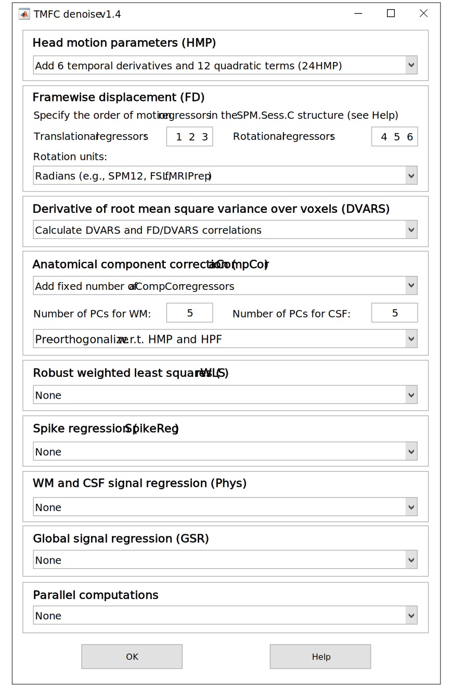

.. _options:

Denoising Options
=================

At the next step, the ``TMFC_denoise`` GUI prompts the user to select denoising options:

   Denoising options GUI.

To open *Denoising options* GUI independently of the main ``TMFC_denoise`` function, run::

    options = tmfc_denoise_options_GUI;

*Outputs:*

.. code-block:: matlab

    options.motion = '24HMP';           % Alternatives: 6HMP, 12HMP
    options.translation_idx = [1 2 3];  % For FSL/AFNI use [4 5 6]
    options.rotation_idx = [4 5 6];     % For FSL/AFNI use [1 2 3]
    options.rotation_unit = 'rad';      % For HCP/AFNI use 'deg'
    options.head_radius = 50;           % Human head radius in [mm]
    options.DVARS = 1;                  % DVARS calculation: 1 = enabled (default), 0 = disabled
    options.aCompCor = [5 5];           % [5 5] for fixed PCs aCompCor (Default: five WM PCs, five CSF PCs);
                                        % [0.5 0.5] for aCompcor50; 
                                        % [0 0] do not calculate aCompCor
    options.aCompCor_ort = 1;           % Pre-orthogonalization: 1 = enabled (default), 0 = disabled
    options.rWLS = 0;                   % rWLS estimation: 1 = enabled, 0 = disabled
    options.spikereg = 0;               % Spike regression: 1 = enabled, 0 = disabled
    options.spikeregFDthr = 0.5;        % Select FD threshold for spike regression
    options.WM_CSF = 'none';            % Alternatives: 2Phys, 4Phys, 8Phys
    options.GSR = 'none';               % Alternatives: GSR, 2GSR, 4GSR
    options.parallel = 0;               % Parallel computations: 1 = enabled, 0 = disabled

Head Motion Parameters (HMP)
----------------------------

-	Use standard six head motion parameters (**6HMP**).
-	Add six temporal derivatives (**12HMP**).
-	Add six temporal derivatives and 12 quadratic terms (**24HMP**) (*default*) (Satterthwaite et al., 2012).
-	Note: Temporal derivatives are computed as backward differences (Van Dijk et al., 2012).

Framewise Displacement (FD)
---------------------------

-	Specify the order of motion regressors in the SPM.Sess.C structure. *By default*, indices for **translational regressors are [1, 2, 3]** and for **rotational regressors are [4, 5, 6]**.
-	**Note:** In SPM, the Human Connectome Project (**HCP**), and **fMRIPrep** the **first three** motion regressors are **translations**. In **FSL** and **AFNI**, the **first three are rotations**. Adding confound regressors in the SPM batch using the “Regressors” option changes the indices of motion regressors defined with the "Multiple regressors" option (``*.txt/*.mat`` files), as they appear last in ``SPM.Sess.C``.
-	Select rotation units: **radians** (for SPM, FSL, fMRIprep) or **degrees** (for HCP or AFNI).
-	**Note:** FD is computed at each time point as the sum of the absolute values of the derivatives of translational and rotational motion parameters (Power et al., 2012).

Derivative of Root Mean Square Variance Over Voxels (DVARS)
-----------------------------------------------------------

-	Calculate **DVARS** and **FD-DVARS correlations** (*default*). 
-	None (do not calculate DVARS).
-	**Note:** DVARS is computed within the GM mask before and after denoising (Muschelli et al., 2014).

Anatomical Component Correction (aCompCor)
------------------------------------------

-	Add a **fixed number of aCompCor regressors**. Specify the number of principal components (PCs) for WM and CSF (*default*: five for each).
-	Add regressors explaining **50% of variance** in WM/CSF.
-	**Note:** aCompCor extracts non-neuronal PCs from WM and CSF signals (Behzadi et al., 2007; Muschelli et al., 2014). It performs well in relatively low-motion samples, according to RSFC benchmarking (Parkes et al., 2017). *By default*, WM/CSF signals are **pre-orthogonalized** with respect to high-pass filter (**HPF**) regressors and head motion parameters (**HMP**) to ensure that the extracted PCs are maximally predictive (Mascali et al., 2021).

Robust Weighted Least Squares (rWLS)
------------------------------------

-	None (*default*) – the updated model uses the autoregression model specified in the original ``SPM.mat`` file (``none``, ``AR(1)``, or ``FAST``).
-	Apply rWLS for model estimation.
-	**Note:** In the first pass, the rWLS algorithm estimates the noise variance of each image. In the second pass, images are weighted by 1/variance rather than being excluded by an arbitrary threshold (as in spike regression, scrubbing, or despiking). This yields a “soft” continuous down-weighting: the higher an image’s variance, the smaller its influence on the results (Diedrichsen and Shadmehr, 2005).

Spike Regression (SpikeReg)
---------------------------

-	None (*default*).
-	For each flagged time point, a unit impulse (1 at that time point, 0 elsewhere) is included as a spike regressor (Lemieux et al., 2007; Satterthwaite et al., 2012). Spike regression combined with WM/CSF regression performs well in high-motion samples, according to RSFC benchmarking (Parkes et al., 2017).
-	**Note:** The default threshold for spike regression is 0.5 mm FD (Power et al., 2012). The FD threshold can be changed to more liberal values (e.g., 0.9 mm; Glasser et al., 2013) in the FD time-series inspection GUI.

WM and CSF Signal Regression (Phys)
-----------------------------------

-	None (*default*).
-	Add WM and CSF signals (**2Phys**) (Fox et al., 2005).
-	Add WM and CSF signals along with their temporal derivatives (**4Phys**).
-	Add WM and CSF signals, two temporal derivatives, and four quadratic terms (**8Phys**) (Parkes et al., 2017).

Global Signal Regression (GSR)
------------------------------

-	None (*default*).
-	Add whole-brain signal (**GSR**) (Fox et al., 2005, 2009).
-	Add whole-brain signal and its temporal derivative (**2GSR**).
-	Add whole-brain signal, its temporal derivative, and two quadratic terms (**4GSR**) (Parkes et al., 2017).
-	**Note:** In RSFC studies, GSR remains controversial. It accounts well for head motion and physiological fluctuations of non-neuronal origin, but it may also remove BOLD signal fluctuations of neuronal origin (Chen et al., 2012) and can introduce spurious negative correlations (Murphy et al., 2008; Murphy & Fox, 2016).

Parallel Computations
---------------------
-	None (*default*).
-	Enable parallel computations.
-	**Note:** On low-end computers, parallelization may decrease overall speed. On mid-range systems, using fewer than the maximum available workers can increase computational efficiency (e.g. 2-4 workers instead of 8-16). To specify the number of workers, enter ``parpool(NumWorkers)`` in the MATLAB command window before running ``TMFC_denoise``.

