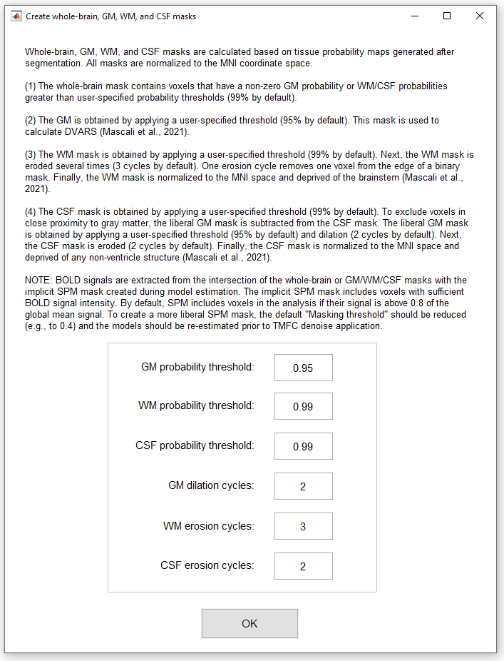
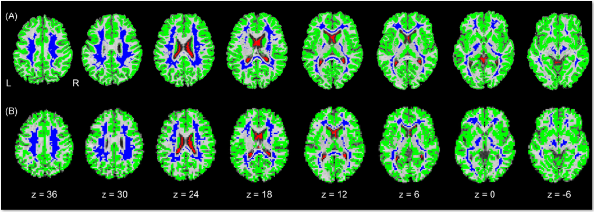

.. _masks:

Mask Generation
===============

If the user chooses to calculate tissue-based regressors and/or DVARS, the ``TMFC_denoise`` GUI 
prompts them to define parameters for GM, WM, CSF, and whole-brain (WB) masks.

   Mask generation GUI.

To open *Mask parameters* GUI independently of the main ``TMFC_denoise`` function, run::
    
    [options.GMmask.prob,   options.WMmask.prob,  options.CSFmask.prob, ...
     options.GMmask.dilate, options.WMmask.erode, options.CSFmask.erode] = tmfc_masks_GUI();

*Output:*

.. code-block:: matlab

    options.GMmask.prob = 0.95;   % Probability threshold for GM mask
    options.WMmask.prob = 0.99;   % Probability threshold for WM mask
    options.CSFmask.prob = 0.99;  % Probability threshold for CSF mask
    options.GMmask.dilate = 2;    % Number of dilation cycles for GM mask
    options.WMmask.erode = 3;     % Number of erosion cycles for WM mask
    options.CSFmask.erode = 2;    % Number of erosion cycles for CSF mask

----

The function ``tmfc_create_masks`` generates binary masks for GM (for DVARS), WM/CSF (for aCompCor and Phys regressors), and the whole brain (for GSR). 
The final masks and intermediate outputs are stored *by default* in the ``TMFC_denoise/[WM99e3]_[CSF99e2]_[GM95d2]/Masks`` subfolders, where ``99`` and ``95`` indicate the selected **probability thresholds**, 
``e2`` refers to the number of **erosion cycles**, and ``d2`` to the number of **dilation cycles**.

   
   Example of binary masks superimposed on the skull-stripped structural image for a single subject. (A) Masks in native space. (B) Masks in MNI space.

The function ``tmfc_create_masks`` is called automatically by the main function TMFC_denoise if the user has selected the corresponding options, or it can be run manually::

    masks = tmfc_create_masks(SPM_paths,anat_paths,func_paths,options);

*Output:*

.. list-table:: Masks variable
   :header-rows: 1
   :widths: 30 70

   * - **Field**
     - **Description**
   * - glm_paths (cell array)
     - Full paths to mask-specific subfolders containing updated GLMs.
   * - mask_paths (cell array)
     - Full paths to mask subfolders.
   * - WM (cell array)
     - Full paths to the final WM masks.
   * - CSF (cell array)
     - Full paths to the final CSF masks.
   * - GM (cell array)
     - Full paths to the final GM masks.
   * - WB (cell array)
     - Full paths to the final whole-brain (WB) masks.

Step-by-Step Mask Creation
--------------------------

Masks are computed as follows:

 1) Segmentation of the unprocessed T1-weighted structural image. This step produces tissue-probability maps used to create individual binary masks (Ashburner & Friston, 2005). The outputs are stored in the TMFC_denoise/Segmentation subfolders and can be reused to generate binary masks with different parameters, without repeating the segmentation step.
 2) Calculation of the eroded WM mask in native space. The WM mask is obtained by applying a user-specified probability threshold (default: WMprob = 99%). The WM mask is then eroded several times (default: three cycles). One erosion cycle removes a one-voxel layer from the edge of the binary mask. 
 3) Calculation of the eroded CSF mask in native space. The CSF mask is obtained by applying a user-specified probability threshold (default: CSFprob = 99%). To exclude voxels adjacent to GM, a liberal GM mask (default: GMprob = 95%, two dilation cycles) is subtracted from the CSF mask. The CSF mask is then eroded (default: two cycles).
 4) Calculation of the GM mask in native space. The GM is obtained by applying a user-specified probability threshold (default: GMprob = 95%). Note: This mask is used for DVARS calculation (Mascali et al., 2021) and is not dilated. 
 5) Calculation of the whole-brain binary mask in native space. This mask contains voxels with nonzero GM probability or with WM/CSF probabilities above the specified thresholds. The equation for the whole-brain binary mask:

    .. math::
    
       ((GM > 0) + (WM > WM_{prob}) + (CSF > CSF_{prob})) > 0

 6) Calculation of the skull-stripped structural image. This image is obtained by multiplying the bias-corrected structural image (mT1w) by a binary mask containing voxels with nonzero GM probability or WM/CSF probabilities above the thresholds. Equation for the skull-stripped structural image:

    .. math::

        mT1w \cdot \left( ((GM > 0) + (WM > WM_{prob}) + (CSF > CSF_{prob})) > 0 \right)

 7) Calculation of the final masks in MNI space. The eroded WM and CSF masks, the GM mask, and the skull-stripped structural image are normalized to MNI space, then resampled and coregistered to the first functional image. In the next step, the WM mask is deprived of the brainstem (Mascali et al., 2021) by subtracting the binary brainstem mask from the Harvard-Oxford atlas (Desikan et al., 2006). The CSF mask is restricted to the ventricles (Muschelli et al., 2014; Mascali et al., 2021) by multiplying with the binary ventricular mask from the Automatic Lateral Ventricle delIneatioN (ALVIN) atlas (Kempton et al., 2011). Finally, all binary masks are multiplied by the implicit SPM mask generated during model estimation (mask.nii), which includes voxels with sufficient BOLD signal intensity.

**Note**: By default, SPM retains voxels in the analysis if their signal is above **0.8** of the global mean. To create a more **liberal implicit mask**, the :menuselection:`Masking threshold` in the SPM first-level model batch can be reduced (e.g., to **0.4**), In this case, the models must be re-estimated before applying ``TMFC_denoise``.

