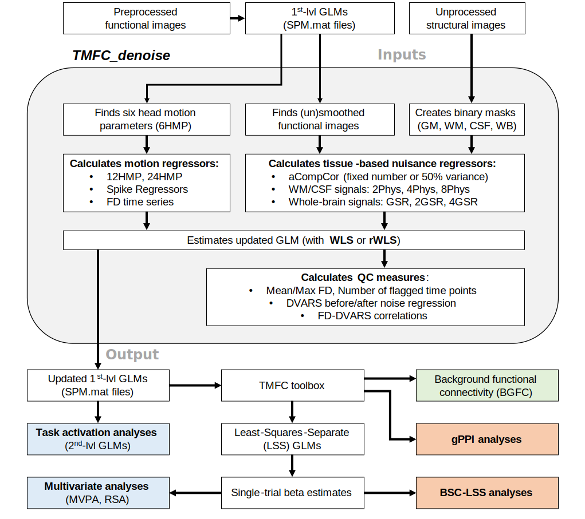

.. _overview:

Overview
========

**TMFC_denoise** provides both a graphical user interface (GUI) and command-line functionality. 
To open the GUI, run the ``TMFC_denoise.m`` function in MATLAB.

**TMFC_denoise** generates nuisance regressors, calculates quality control (QC) measures, 
and estimates updated GLMs using weighted least-squares (WLS) or robust WLS (rWLS). 

   TMFC_denoise overview.

Inputs
------

Inputs include unprocessed structural and preprocessed functional images, 
together with first-level GLMs specified in SPM. 

Users specify paths to first-level GLMs (``SPM.mat`` files), select denoising options, 
and set masking parameters. First-level GLMs must be **specified and estimated** in SPM12 or SPM25 and 
**must include six head motion regressors**. 

Unprocessed structural and preprocessed functional images can be automatically identified through the GUI. 
Functional images may be preprocessed using an SPM-based pipeline 
(e.g., see the ``preproc_fmri.m`` function in ``/spm/batches/``; Penny et al., 2011) 
or with alternative pipelines such as fMRIPrep (Esteban et al., 2019). 
Preprocessing should include **realignment** and **normalization**, whereas **slice-time correction** and **smoothing** are optional. 

Denoising Options
-----------------

1) Head motion expansions
2) Framewise displacement (FD)
3) Spike regressors
4) aCompCor regressors 
5) WM/CSF regressors
6) Global signal regressors (GSR)
7) DVARS (Derivative of root mean square VARiance over voxelS) and FD-DVARS correlations
8) Robust weighted least squares (rWLS)

Outputs
-------

All outputs, including noise regressors, updated GLMs, and QC measures, 
are saved in a ``TMFC_denoise`` subfolder within each subject’s first-level GLM directory. 
Group-level QC measures can be saved as a single ``.mat`` file in a user-specified directory.

How to Use Updated GLMs
-----------------------

1. Updated GLMs can be used for **task-based activation analyses**. 

2. Updated GLMs can be used as **input to the TMFC toolbox**, which implements:

- **Background functional connectivity (BGFC)**
- **Least-squares-separate (LSS) GLMs**
- **Beta-series correlation (BSC-LSS)**
- **gPPI with deconvolution**

3. The **TMFC toolbox** can also generate denoised **volume of interest (VOI)** files 
for **dynamic causal modelling (DCM)**. **Note:** The original model should be prepared for DCM analysis. 
Both **TMFC_denoise** and the **TMFC toolbox** support ``SPM.mat`` files with concatenated sessions (i.e. ``spm_fmri_concatenate.m``). 

4. Denoised **single-trial beta estimates** (outputs of LSS GLMs) can also be used for **multivariate approaches**, 
including **multivoxel pattern analysis (MVPA)** and **representational similarity analysis (RSA)**.

