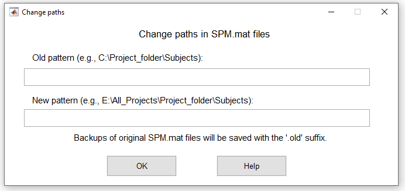

Prepare Your Data
=================

TMFC_denoise uses information from ``SPM.mat`` files to obtain paths to functional images and SPM binary masks. 

Original GLMs
-------------

The original model must be **estimated** (not only **specified**) in SPM12 or SPM25. 

**Note:** Original models must include **six head motion regressors**, 
and the specified functinal images must be **realigned** and **normalized** (smoothing is optional).

If you estimated first-level GLMs and later moved the GLM or functinal-image folders to another location, 
you need to update the paths specified in the ``SPM.mat`` files (``SPM.xY.VY`` and ``SPM.swd`` fields).

To change paths in ``SPM.mat`` files using the GUI, enter the following command in the MATLAB window::

    tmfc_change_paths_GUI

If you use the TMFC toolbox GUI, click :menuselection:`Tools → Change paths`.
 
Select the subjects whose ``SPM.mat`` files you want to update. 
Enter the old path pattern (see ``SPM.swd`` field in the SPM.mat file) and the new path pattern:

   Change paths GUI.

To change paths in ``SPM.mat`` files from the command line, enter::

    tmfc_change_paths_GUI(SPM_paths, old_path, new_path)

Structural Images
-----------------

To calculate tissue-based regressors and/or DVARS, you need to create tissue-specific binary masks.
These masks are generated from unprocessed T1-weighted structural images. Structural images must be in **native space**, 
since binary masks are created in native space and later normalized to MNI space. 

Structural images can be coregistered with functional images (optional).  
This is not necessary because TMFC_denoise automatically coregisters the skull-stripped structural image and binary masks to the functional images.

Structural images may be in ``*.img``/``*.hdr``, ``*.nii``, or ``*.nii.gz`` format. 

**Note:** To automatically select structural images using the GUI, they must:
- Have the same root folder and subfolder structure,
- Share the same file format, and  
- Have a consistent name pattern (to be uniquely detected via a text filter, e.g., ``*T1*.nii*``).

Functional Images
-----------------

To calculate tissue-based regressors or DVARS, you should extract tissue-specific signals from **unsmoothed** functional images.
Functional images must be **realigned** and **normalized**, as binary masks are normalized to MNI space.

If your original model was specified for unsmoothed images, simply press :menuselection:`Preserve functional image paths from the SPM.mat files` during functional image selection.  
If your model was specified for smoothed images, you need to provide paths to unsmoothed images.

In principle, tissue-specific signals can be extracted from smoothed images (e.g., if unsmoothed data are unavailable), but unsmoothed images are preferred for noise-regressor creation. 

Images can be either ``*.img``/``*.hdr`` (3D) or ``*.nii`` (3D/4D). The ``*.nii.gz`` format is not supported.

**Note:** To automatically select functional images using the GUI, they must:
- Have the same root folder and subfolder structure,
- Share the same file format, and  
- Follow a consistent name pattern (to be uniquely detected via a text filter, e.g., ``*war*.nii``).

