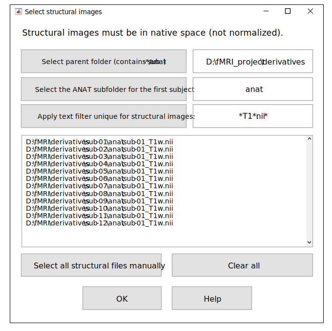

.. _select-anat:

Select Structural Images
========================

If the user chooses to calculate tissue-based regressors and/or DVARS, the ``TMFC_denoise`` GUI 
prompts them to select unprocessed T1-weighted structural images (in native space). 

   Select structural images GUI.

First, select the parent folder that contains the subject folders with ``ANAT`` subfolders for 
unprocessed T1-weighted structural images (if necessary). 
By default, the parent folders for first-level GLMs 
and ``ANAT`` subfolders are assumed to be the same (in BIDS they differ). 

Second, select the ``ANAT`` subfolder for the first subject. 
Third, apply a text filter (e.g., ``*T1*.nii*``) to match all T1 images. 
Images may be in ``*.img``/``*.hdr``, ``*.nii`` or ``*.nii.gz`` format. 

Alternatively, all structural images can be selected manually — for example, when they are stored in a single folder. 
To do this, press: :menuselection:`Select all structural files manually` 

To open *Select structural images* GUI independently of the main ``TMFC_denoise`` function, run::
    
    anat_paths = tmfc_select_anat_GUI(subject_paths);

*Output:*

- ``anat_paths`` — Full paths to unprocessed (native-space) T1-weighted structural images (cell array)  

---------------------------------------------------------------------------

Example 1 — SPM-like Folder Structure
-------------------------------------

In this case, there is no need to change the parent folder to select structural images.

.. code-block:: text

   project/
   ├─ rawdata/      # DICOM
   └─ derivatives/  <-------- [Parent folder with ANAT subfolders (BY DEFAULT)]
      ├─ sub-01/    <-------------------------------- [Selected subject folder]
      │  ├─ anat/   <-------- [Select the ANAT subfolder for the first subject] (1)
      │  │  ├─ *T1*.nii  <--------------------------------- [Apply text filter] (2)
      │  │  └─ *T1*.nii derivatives (tissue seg., bias-corrected T1, etc.)
      │  ├─ func/
      │  │  ├─ sess-01/
      │  │  │  ├─ Unprocessed functional files (*.nii)
      │  │  │  └─ Preprocessed functional files:
      │  │  │       • smoothed + normalized + realigned (e.g., swar*.nii)
      │  │  │       • unsmoothed + normalized + realigned (e.g., war*.nii)
      │  │  └─ sess-02/ ...
      │  └─ stat/       # First-level models (one folder per GLM)
      │     ├─ GLM-01/
      │     │  ├─ SPM.mat    <------------------------- [Selected SPM.mat file]
      │     │  └─ TMFC_denoise/  <----------------------------- [Output folder]
      │     └─ GLM-02/ ...
      └─ sub-02/ ...         

---------------------------------------------------------------------------

Example 2 — BIDS-like Folder Structure
--------------------------------------

1. Select the parent folder that contains all subject folders with ``ANAT`` subfolders (if necessary).  
2. Select the ``ANAT`` subfolder for the first subject and apply text filter (e.g., ``*T1*.nii``) to match all T1 images.

Here, the default parent folder ``project/derivatives/firstlevel-spm`` (with ``STAT`` subfolders) 
needs to be changed to ``project`` — the parent folder with ``ANAT`` subfolders.

.. code-block:: text

   project/   <------------------- [Select parent folder (contains sub-*/anat)]  (1)
   ├── sub-01/
   │   ├── ses-01/
   │   │   ├── anat/   <----- [Select the ANAT subfolder for the first subject]  (2)
   │   │   │   └── *T1*.nii   <---------------------------- [Apply text filter]  (3)
   │   │   └── func/         # Unprocessed functional files
   │   └── ses-02/ ...
   ├── sub-02/ ...
   └── derivatives/
       ├── fmriprep/
       │   ├── sub-01/
       │   │   ├── ses-01/
       │   │   │   └── func/
       │   │   │       └── Preprocessed functional files:
       │   │   │           • smoothed + normalized + realigned
       │   │   │           • unsmoothed + normalized + realigned
       │   │   └── ses-02/ ...
       │   └── sub-02/ ...
       └── firstlevel-spm/  <-- [Parent folder with ANAT (BY DEFAULT)](Needs to be changed!)
           ├── sub-01/   <--------------------------- [Selected subject folder]
           │   ├── GLM-01/
           │   │   ├── SPM.mat   <--------------------- [Selected SPM.mat file]
           │   │   └── TMFC_denoise/  <------------------------ [Output folder]
           │   └── GLM-02/ ...
           └── sub-02/ ...   

---------------------------------------------------------------------------

Example 3 — Other (Non-BIDS) Folder Structure
---------------------------------------------

1. Select the parent folder that contains all subject folders with ``ANAT`` subfolders (if necessary).  
2. Select the ``ANAT`` subfolder for the first subject and apply text filter (e.g., ``*T1*.nii``) to match all T1 images.

Here, the default parent folder ``project/firstlevel-spm`` (with ``STAT`` subfolders) 
needs to be changed to ``project/nifti`` — the parent folder with ``ANAT`` subfolders.

.. code-block:: text

   project/
   ├─ rawdata/   # DICOM
   ├─ nifti/   <------------------- [Select parent folder (contains sub-*/anat)]  (1)
   │  ├─ sub-01/
   │  │  ├─ anat/  <---------- [Select the ANAT subfolder for the first subject]  (2)
   │  │  │  ├─ *T1*.nii  <---------------------------------- [Apply text filter]  (3)
   │  │  │  └─ *T1*.nii derivatives (tissue seg., bias-corrected T1, etc.)
   │  │  └─ func/
   │  │     ├─ sess-01/
   │  │     │  ├─ Unprocessed functional files (*.nii)
   │  │     │  └─ Preprocessed functional files (*.nii):
   │  │     │     • smoothed + normalized + realigned
   │  │     │     • unsmoothed + normalized + realigned
   │  │     └─ sess-02/ ...
   │  └─ sub-02/ ...
   └─ firstlevel-spm/  <-- [Parent folder with ANAT subfolders (BY DEFAULT)](Needs to be changed!)
      ├─ sub-01/   <---------------------------------- [Selected subject folder]
      │  ├─ GLM-01/
      │  │  ├─ SPM.mat   <------------------------------ [Selected SPM.mat file]
      │  │  └─ TMFC_denoise/   <-------------------------------- [Output folder]
      │  └─ GLM-02/ ...
      └─ sub-02/ ... 

 

