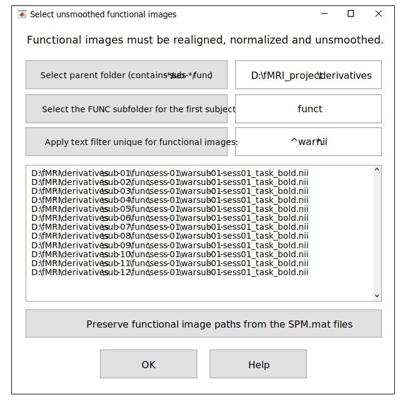

.. _select-func:

Select Functional Images
========================

If the user chooses to calculate tissue-based regressors and/or DVARS, the ``TMFC_denoise`` GUI 
prompts them to select unsmoothed preprocessed functional images (in MNI space). 

**Note:** The updated GLMs are specified and estimated using the functional images listed in the 
original ``SPM.mat`` files (the ``SPM.xY.VY`` field). Thus, if smoothed images were used originally, 
they will be retained in the updated GLMs, while nuisance regressors will be calculated from the unsmoothed images. 
Although tissue-specific signals *can* be extracted from smoothed images (e.g., if unsmoothed data are unavailable), 
but unsmoothed images are preferred for noise-regressor creation. 

   Select functional images GUI.

First, select the parent folder that contains the subject folders with ``FUNC`` subfolders for 
preprocessed T2*-weighted functional images (if necessary). 
By default, the parent folders for first-level GLMs 
and ``FUNC`` subfolders are assumed to be the same (in BIDS they differ). 

Second, select the ``FUNC`` subfolder for the first subject. 
This subfolder may include multiple session-specific subfolders (e.g., sess-01, sess-02). 
Third, apply a text filter (e.g., *war*.nii) to match all unsmoothed images. 
Images can be either ``*.img``/``*.hdr`` (3D) or ``*.nii`` (3D/4D). The ``*.nii.gz`` format is not supported.

**NOTE:** You can also try applying the text filter without changing folders.

  • If you do NOT select a new parent folder (FUNC root), the toolbox will
    use the same parent directory as the STAT folder (SPM.mat).

  • If you do NOT select a FUNC subfolder for the first subject, the toolbox
    will attempt to use the same relative structure as in SPM.xY.VY paths.

In both cases, the search will be performed automatically using paths
derived from the original SPM.mat configuration, so it may still find the
correct functional files — provided their locations have not changed.

Sessions/runs:
• Layout sub-01/func/sess-* → select func as the FUNC subfolder.
• Layout sub-01/ses-*/func → leave the subfolder unselected (or select the subject folder); the toolbox will resolve each session/run automatically.

If the GLMs were **already specified for unsmoothed images**, simply press: :menuselection:`Preserve functional image paths from the SPM.mat files`

To open *Select functional images* GUI independently of the main ``TMFC_denoise`` function, run::
    
    func_paths = tmfc_select_func_GUI(SPM_paths,subject_paths);

*Output:*

- ``func_paths`` — Full paths to unsmoothed preprocessed (MNI-space, realigned) functional images (cell array)  

---------------------------------------------------------------------------

Example 1 — SPM-like Folder Structure
-------------------------------------

In this case, there is no need to change the parent folder to select functional images.

.. code-block:: text

   project/
   ├─ rawdata/      # DICOM
   └─ derivatives/  <------------------ [Parent folder with FUNC subfolders (BY DEFAULT)]
      ├─ sub-01/    <------------------------------------------ [Selected subject folder]
      │  ├─ anat/   
      │  │  ├─ *T1*.nii  
      │  │  └─ *T1*.nii derivatives 
      │  ├─ func/  <------------------- [Select the FUNC subfolder for the first subject] (1)
      │  │  ├─ sess-01/
      │  │  │  ├─ Unprocessed functional files (*.nii)
      │  │  │  └─ Preprocessed functional files:
      │  │  │       • smoothed + normalized + realigned (e.g., swar*.nii)
      │  │  │       • unsmoothed + norm. + real. (e.g., war*.nii) <-- [Apply text filter] (2)
      │  │  └─ sess-02/ ...
      │  └─ stat/       # First-level models (one folder per GLM)
      │     ├─ GLM-01/
      │     │  ├─ SPM.mat    <----------------------------------- [Selected SPM.mat file]
      │     │  └─ TMFC_denoise/  <--------------------------------------- [Output folder]
      │     └─ GLM-02/ ...
      └─ sub-02/ ...         

---------------------------------------------------------------------------

Example 2 — BIDS-like Folder Structure
--------------------------------------

1. Select the parent folder that contains all subject folders with ``FUNC`` subfolders (if necessary).  
2. Apply text filter (e.g., ``*war*.nii``, ``*wr*.nii``, or ``*preproc*.nii.gz``) to match all fMRI images.

Here, the default parent folder ``project/derivatives/firstlevel-spm`` (with ``STAT`` subfolders) 
needs to be changed to ``project/derivatives/fmriprep`` — the parent folder with ``FUNC`` subfolders.

.. code-block:: text

   project/  
   ├── sub-01/
   │   ├── ses-01/
   │   │   ├── anat/   
   │   │   │   └── *T1*.nii  
   │   │   └── func/         # Unprocessed functional files
   │   └── ses-02/ ...
   ├── sub-02/ ...
   └── derivatives/
       ├── fmriprep/   <-------------- [Select parent folder (contains sub-*/ses-*/func)] (1)
       │   ├── sub-01/
       │   │   ├── ses-01/   
       │   │   │   └── func/ 
       │   │   │       └── Preprocessed functional files:
       │   │   │           • smoothed + normalized + realigned
       │   │   │           • unsmoothed + normalized + realigned <--- [Apply text filter] (2)
       │   │   └── ses-02/ ...
       │   └── sub-02/ ...
       └── firstlevel-spm/  <--- [Parent folder with FUNC (BY DEFAULT)](Needs to be changed!)
           ├── sub-01/   <------------------------------------- [Selected subject folder]
           │   ├── GLM-01/
           │   │   ├── SPM.mat   <------------------------------- [Selected SPM.mat file]
           │   │   └── TMFC_denoise/  <---------------------------------- [Output folder]
           │   └── GLM-02/ ...
           └── sub-02/ ...   

---------------------------------------------------------------------------

Example 3 — Other (Non-BIDS) Folder Structure
---------------------------------------------

1. Select the parent folder that contains all subject folders with ``FUNC`` subfolders (if necessary).  
2. Select the ``FUNC`` subfolder for the first subject and apply text filter (e.g., ``*war*.nii``, ``*wr*.nii``, or ``*preproc*.nii.gz``) to match all fMRI images.

Here, the default parent folder ``project/firstlevel-spm`` (with ``STAT`` subfolders) 
needs to be changed to ``project/nifti`` — the parent folder with ``FUNC`` subfolders.

.. code-block:: text

   project/
   ├─ rawdata/   # DICOM
   ├─ nifti/   <---------------- [Select parent folder (contains sub-*/ses-*/func)]  (1)
   │  ├─ sub-01/
   │  │  ├─ anat/  
   │  │  │  ├─ *T1*.nii 
   │  │  │  └─ *T1*.nii derivatives
   │  │  └─ func/    <----------- [Select the FUNC subfolder for the first subject]  (2)
   │  │     ├─ sess-01/
   │  │     │  ├─ Unprocessed functional files (*.nii)
   │  │     │  └─ Preprocessed functional files (*.nii):
   │  │     │     • smoothed + normalized + realigned
   │  │     │     • unsmoothed + normalized + realigned  <----- [Apply text filter] (3)
   │  │     └─ sess-02/ ...
   │  └─ sub-02/ ...
   └─ firstlevel-spm/  <-- [Parent folder with FUNC subfolders (BY DEFAULT)](Needs to be changed!)
      ├─ sub-01/   <------------------------------------- [Selected subject folder]
      │  ├─ GLM-01/
      │  │  ├─ SPM.mat   <--------------------------------- [Selected SPM.mat file]
      │  │  └─ TMFC_denoise/   <----------------------------------- [Output folder]
      │  └─ GLM-02/ ...
      └─ sub-02/ ... 

 

