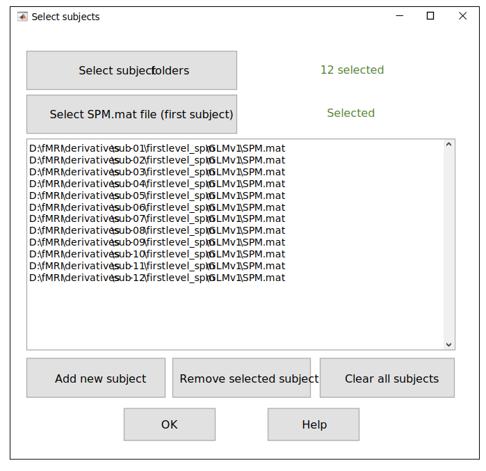

.. _select-sub:

Select Subjects
===============

At the first step, the ``TMFC_denoise`` GUI prompts the user to select the first-level GLMs to be updated with nuisance regressors. 

   Select subjects GUI.

First, select the subject folders, each containing a subfolder with first-level GLMs. 
Then, select the ``SPM.mat`` file for the GLM of interest for the **first subject**. 
Paths to GLMs for all other subjects will be constructed automatically.

To open *Select subjects* GUI independently of the main ``TMFC_denoise`` function, run::
    
    [SPM_paths, subject_paths] = tmfc_select_subjects_GUI(0);

*Outputs:*

- ``SPM_paths`` — Full paths to selected ``SPM.mat`` files (cell array)  
- ``subject_paths`` — Paths to selected subject folders (cell array)

---------------------------------------------------------------------------

Example 1 — SPM-like Folder Structure
-------------------------------------

1. Select the subject folders (each containing a ``STAT`` subfolder with an ``SPM.mat`` file).  
2. Select the ``SPM.mat`` file for the first subject.

.. code-block:: text

   project/
   ├─ rawdata/   # DICOM
   └─ derivatives/
      ├─ sub-01/   <------------------------------------- [Select subject folder #1] (1)
      │  ├─ anat/
      │  │  ├─ *T1*.nii
      │  │  └─ *T1*.nii derivatives
      │  ├─ func/
      │  │  ├─ sess-01/
      │  │  │  ├─ Unprocessed functional files (*.nii)
      │  │  │  └─ Preprocessed functional files:
      │  │  │       • smoothed + normalized + realigned (e.g., swar*.nii)
      │  │  │       • unsmoothed + normalized + realigned (e.g., war*.nii)
      │  │  └─ sess-02/ ...
      │  └─ stat/             # First-level models (one folder per GLM)
      │     ├─ GLM-01/
      │     │  ├─ SPM.mat   <-------------------- [Select SPM.mat for first subject] (2)
      │     │  └─ TMFC_denoise/  <---------------------------------- [Output folder]
      │     └─ GLM-02/ ...
      └─ sub-02/ ...          <-------------------------- [Select subject folder #2] (1)

---------------------------------------------------------------------------

Example 2 — BIDS-like Folder Structure
--------------------------------------

1. Select the subject folders (each containing a ``STAT`` subfolder with an ``SPM.mat`` file).  
2. Select the ``SPM.mat`` file for the first subject.

.. code-block:: text

   project/
   ├── sub-01/
   │   ├── ses-01/
   │   │   ├── anat/
   │   │   │   └── *T1*.nii
   │   │   └── func/         # Unprocessed functional files
   │   └── ses-02/ ...
   ├── sub-02/ ...
   └── derivatives/
       ├── fmriprep/
       │   ├── sub-01/
       │   │   ├── ses-01/
       │   │   │   └── func/
       │   │   │       └── Preprocessed functional files:
       │   │   │           • smoothed + normalized + realigned
       │   │   │           • unsmoothed + normalized + realigned
       │   │   └── ses-02/ ...
       │   └── sub-02/ ...
       └── firstlevel-spm/
           ├── sub-01/   <------------------------- [Select subject folder #1] (1)
           │   ├── GLM-01/
           │   │   ├── SPM.mat   <--------- [Select SPM.mat for first subject] (2)
           │   │   └── TMFC_denoise/  <----------------------- [Output folder]
           │   └── GLM-02/ ...
           └── sub-02/ ...   <--------------------- [Select subject folder #2] (1)

---------------------------------------------------------------------------

Example 3 — Other (Non-BIDS) Folder Structure
---------------------------------------------

1. Select the subject folders (each containing a ``STAT`` subfolder with an ``SPM.mat`` file).  
2. Select the ``SPM.mat`` file for the first subject.

.. code-block:: text

   project/
   ├─ rawdata/   # DICOM
   ├─ nifti/
   │  ├─ sub-01/
   │  │  ├─ anat/
   │  │  │  ├─ *T1*.nii
   │  │  │  └─ *T1*.nii derivatives
   │  │  └─ func/
   │  │     ├─ sess-01/
   │  │     │  ├─ Unprocessed functional files (*.nii)
   │  │     │  └─ Preprocessed functional files (*.nii):
   │  │     │     • smoothed + normalized + realigned
   │  │     │     • unsmoothed + normalized + realigned
   │  │     └─ sess-02/ ...
   │  └─ sub-02/ ...
   └─ firstlevel-spm/
      ├─ sub-01/   <--------------------------------- [Select subject folder #1] (1)
      │  ├─ GLM-01/
      │  │  ├─ SPM.mat   <------------------- [Select SPM.mat for first subject] (2)
      │  │  └─ TMFC_denoise/   <-------------------------------- [Output folder]
      │  └─ GLM-02/ ...
      └─ sub-02/ ...   <----------------------------- [Select subject folder #2] (1)

 

